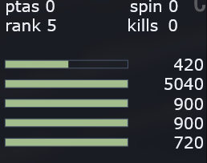
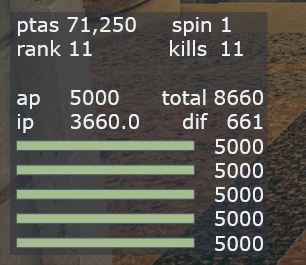

# RE4R SRT Overlay (with/without DA0 stuff)

Original by  [resyst (github.com)](https://github.com/resyst)

Displays Peseta count, kill count, DA rank, Spinels count and Enemy HP bars. Optionally include DA0 related info, including total points (action + item points), and how much points you need to lose to get to a DA0 value

TO INSTALL: 
1. Make sure REFramework is installed [REFramework at Resident Evil 4 (2023) - Nexus mods and community](https://www.nexusmods.com/residentevil42023/mods/12)
2. Make sure REFramework direct2D is installed [https://www.nexusmods.com/residentevil42023/mods/83]
3. Put srt-overlay.lua OR srt-overlay-da0.lua in reframework/autorun folder (in your RE4 game folder)

EXTRA OPTIONS:
In the .lua files there are 2 variables to adjust 
1. 'scale' variable to make it smaller/bigger
2. 'percent' variable to make enemy HP in raw values or % based (true/false)

No DA0 version

DA0 version

